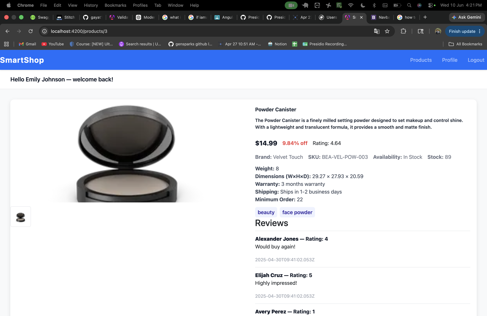
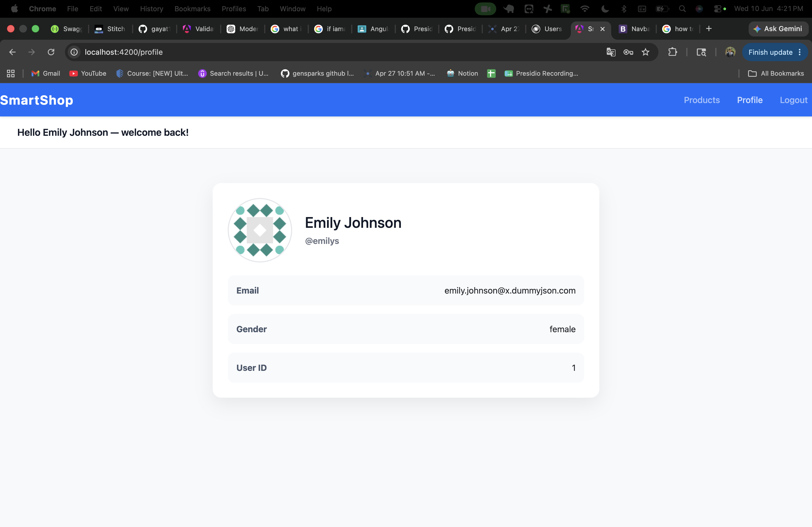

## To run the application execute the following commands in the terminal of your project directory

`npm install`

`ng servie`

- visit browser

`http://localhost:4200` enter this url

---

## Output images

